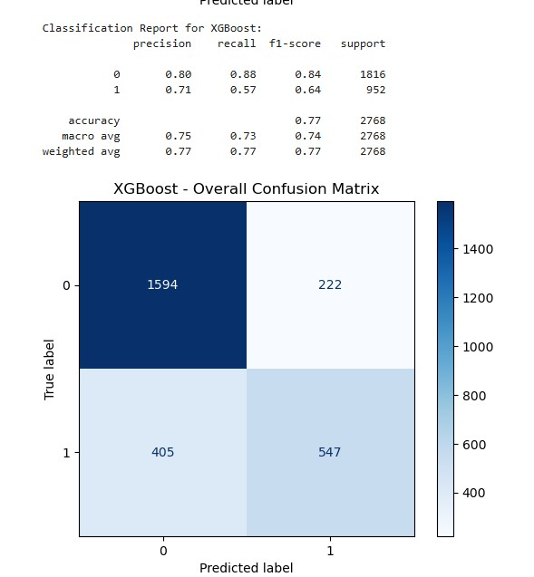
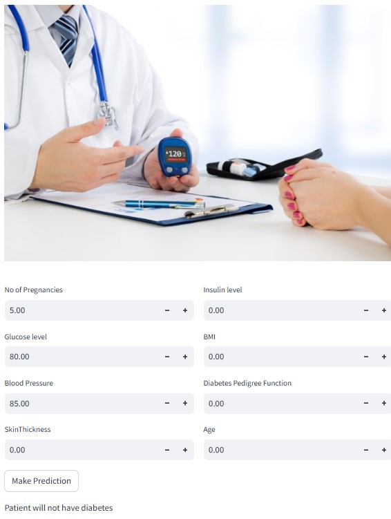

# Diabetes Prediction Model

## Table of Contents
- [Project Overview](#project-overview)
- [Dataset Overview](#dataset-overview)
- [Data Preprocessing](#data-preprocessing)
- [Model Building](#model-building)
- [Feature Importance](#feature-importance)
- [Model Evaluation](#model-evaluation)
- [Model Deployment](#model-deployment)

## Project Overview
Diabetes Mellitus is one of the leading cause of morbidity and mortality. This project focuses on building a machine learning model to predict
whether a patient is likely to develop diabetes based on various medical attributes. The goal is to identify patterns that can help in early 
diagnosis and improve patient outcomes.

## Dataset Overview
The dataset includes features such as number of id, pregnancies, glucose levels, blood pressure, skin thickness, insulin, BMI, diabetes pedigree
function, age and outcome (the target variable).
Below is ths Data Dictionary and screenshot of the dataset

- **Id:** Unique identifier for each data entry
- **Pregnancies:** Number of times the patient has been pregnant
- **Glucose:** Plasma glucose concentration over 2 hours in an oral glucose tolerance test
- **BloodPressure:** Diastolic blood pressure (mm Hg)
- **SkinThickness:** Triceps skinfold thickness (mm)
- **Insulin:** 2-Hour serum insulin (mu U/ml)
- **BMI:** Body mass index (weight in kg / height in m^2)
- **DiabetesPedigreeFunction:** Diabetes pedigree function, a genetic score of diabetes
- **Age:** Age in years
- **Outcome:** Binary classification indicating the presence (1) or absence (0) of diabetes

## Data Preprocessing
Data preprocessing was done to prepare the data for modelling
- **Handle missing values**: Ensured that all missing values in the dataset were properly addressed.
- **Remove duplicates**: Checked for duplicate values to avoid redundancy. No duplicate was found in the datasetand.
- **Scale numerical variables**: The dataset variables were all numerical. So they were scaled to ensure consistent scaling.

## Model Building
Six machine learning classifiers:
- Logistic Regression
- Bagging Classifier
- Random Forest Classifier
- Support Vector Machine (SVM)
- Decision Tree 
- XGBoost were imported
The classifiers were trained on the training dataset, and evaluated on the test subset of the dataset.

## Feature Importance
The following table lists the importance scores of various features used in the model. The higher value, the greater importance 
of the feature in the prediction by the model.

The feature importance for the XGBoost model was determined using the **"gain" metric**, which reflects how much each feature improves the performance of splits in the decision trees.

The top 3 most important features were:

**Glucose:** Showed the highest importance, making significant contributions in predicting the target variable.
**BMI:** Ranked second in importance, indicating its strong influence on the predictions.
**Age:** Also played an important role in predicting the outcome.
**Insulin**, **DiabetesPedigreeFunction** and **SkinThickness**, contributed moderately to the model's performance, though they had lower importance compared to the top features.
**Pregnancies** and **BloodPressure** though contributed to the model, there importances were lower than other key features.ficant for the model.

Overall, glucose level, BMI, and pain are the most important features in the model performance, while insulin level, Diabetes Pedigree function and skin thickness have moderate influence.

## Model Evaluation
The performance of the models was evaluated on the test dataset using metrics such as accuracy, precision, recall, and F1-score.
Below is a screenshot of the evaluation reports and XGBoost confusion matrix from the notebook:

## Model Deployment
The model was deployed using Streamlit

